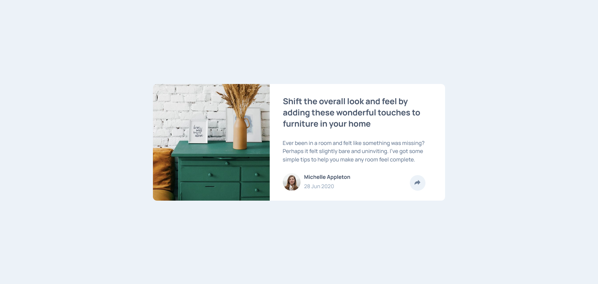

# Frontend Mentor - Article preview component solution

This is a solution to the [Article preview component challenge on Frontend Mentor](https://www.frontendmentor.io/challenges/article-preview-component-dYBN_pYFT). Frontend Mentor challenges help you improve your coding skills by building realistic projects. 

## Table of contents

- [Overview](#overview)
  - [The challenge](#the-challenge)
  - [Screenshot](#screenshot)
  - [Links](#links)
- [My process](#my-process)
  - [Built with](#built-with)
  - [Useful resources](#useful-resources)
- [Author](#author)

**Note: Delete this note and update the table of contents based on what sections you keep.**

## Overview

### The challenge

Users should be able to:

- View the optimal layout for the component depending on their device's screen size
- See the social media share links when they click the share icon

### Screenshot

### Links

- Solution URL: [https://github.com/tiago-ro/article-preview](https://github.com/tiago-ro/article-preview)
- Live Site URL: [https://tiago-ro.github.io/article-preview](https://tiago-ro.github.io/article-preview)

## My process

### Built with

- Semantic HTML5 markup
- CSS custom properties
- Flexbox
- CSS Grid
- Mobile-first workflow

### Useful resources

- [w3schools.com](https://www.w3schools.com) 
- [cfbcursos](https://www.youtube.com/@cfbcursos)

## Author

- Website - [Github](https://github.com/tiago-ro)
- Frontend Mentor - [@tiago-ro](https://www.frontendmentor.io/profile/tiago-ro)